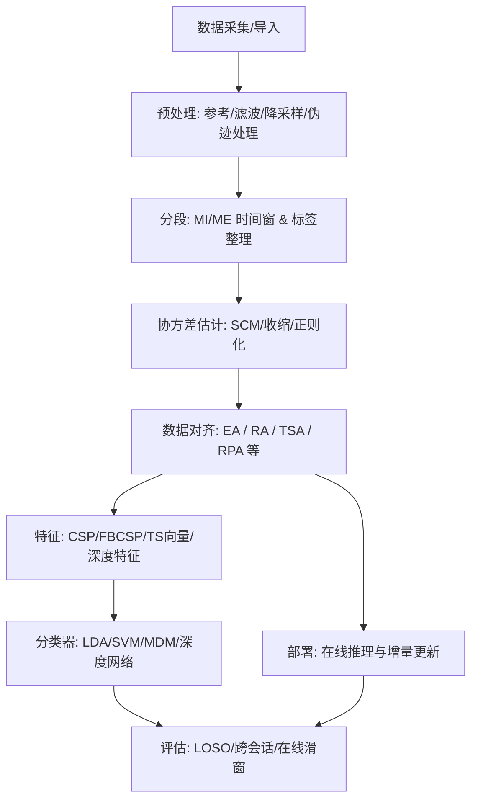

# 跨被试脑电运动意图识别中的数据对齐研究综述与工程化指南

## 执行摘要

跨被试（cross-subject）脑电（EEG）运动意图识别（以运动想象 MI、运动执行 ME 为主）面临的核心困难是**分布漂移与表征不一致**：不同被试在电极接触阻抗、个体解剖与生理差异、任务策略、噪声与伪迹等方面差异显著，导致“同一类运动意图”的 EEG 特征在统计上并不对齐，从而使“在被试 A 上训练、在被试 B 上直接推理”的性能大幅下降。Tangent Space Alignment（TSA）工作在大规模（18 个 BCI 数据库、349 名被试）验证了此类跨被试/跨会话差异的普遍性，并指出其方法可在不牺牲 MI/SSVEP 最优 train-test 性能的情况下进行迁移，同时相对 RPA 存在整体优势。citeturn37view0turn38view3

“数据对齐（data alignment）”是解决跨被试难题的关键方案之一，其思想是：在尽量不依赖（或少依赖）目标被试标注的条件下，通过**线性/仿射变换、流形对齐、子空间对齐或深度特征对齐**，把源域与目标域映射到共享参考系，使后续特征提取与分类器能“看见更一致的数据分布”。典型代表包括：  
- **欧式对齐 EA（Euclidean Alignment）**：对每个被试学习一个“白化式”线性变换，使其平均协方差趋近单位阵，从而显著减弱跨被试尺度与相关结构差异，并能与任意欧式特征提取/分类器组合；在离线无监督跨被试 MI 上，EA-CSP-LDA 在 16 名被试中多数情况下优于 RA-MDRM，且计算速度快 3.6–19.5 倍（随数据集与通道数变化）。citeturn1view1turn1view2  
- **黎曼/切空间对齐（RA/RPA/TSA）**：以 SPD（对称正定）协方差矩阵流形为基础，采用平行移动/重中心化/伸缩/旋转等步骤减少域间差异；TSA 在多个 MI 数据集中给出 train-test、TSA、RPA 的对比结果，并提供显著性检验。citeturn38view3turn37view0  
- **对齐 + 域适应（如 MEKT、KMDA）**：在对齐基础上再做分布匹配（MMD/联合分布/图正则等）。MEKT 在 MI 数据集的 STS/MTS 设置下显著优于 EA、RA-MDM 等基线，并同时报告了计算耗时对比。citeturn33view1turn33view2  KMDA 在 BCI IV 2a 等数据上用 Kappa/Accuracy 报告了优于多种域适应方法的结果，并描述了数据裁剪与滤波设置。citeturn49view2turn49view1  
- **统一基准证据（近年）**：NeurIPS 2025 workshop 的统一基准对 BCI IV 2a/2b 的跨被试与跨会话进行了系统复现对比，给出跨被试 2a（2 类/4 类）下 EA、LEA、RA-MDRM、TSA、RPA、MEKT 等方法的均值±方差（见本文图表与汇总表）。citeturn4view0turn3view0  

工程上，数据对齐往往是**最“性价比高”的跨被试增强模块**：可作为前处理插入几乎所有流水线（CSP/FBCSP、切空间特征、浅层/深层网络），额外计算通常为一次协方差估计与矩阵分解（通道数越高越需正则与数值保护）。同时也存在常见陷阱：如在交叉验证中用到了测试段目标数据估计对齐矩阵（数据泄漏）、协方差奇异导致逆平方根失败、通道顺序/参考不一致导致“对齐错对象”等。citeturn19view0turn1view1  

以下报告将以 2019–至今文献为主（必要时补充关键奠基工作），围绕“数据对齐”提供方法谱系、数学原理、实现步骤、近五年对比证据（含表与图）、工程化流程与参数建议（覆盖低/中/高通道与 128/256/512 Hz）、常见坑与规避策略、以及开源工具/代码/数据集清单（含链接与使用要点）。

## 方法综述

### 数据对齐在跨被试 MI/ME 中的位置

跨被试 EEG 运动意图识别可以抽象为域适应（Domain Adaptation, DA）/迁移学习：源域为一批已标注被试，目标域为新被试（往往无标注或少量标注）。对齐策略通常出现在两处：  
- **信号/协方差层对齐（input / second-order alignment）**：直接在时域 EEG 试次或其协方差矩阵上做变换（EA、RA、RPA 等）。其优点是模型无关、可复用、可解释。EA 论文明确将其作为“可插拔预处理”，并展示对训练/测试被试分布差异的可视化减弱效果。citeturn1view0turn1view1  
- **特征层对齐（feature alignment）**：在传统特征（如 CSP 特征/切空间向量）或深度特征上加对齐损失（CORAL/MMD/对抗）。KMDA 属于“协方差对齐 + 核空间子空间学习/分布匹配”的组合框架。citeturn49view3turn48view0  

### 方法类别与代表算法

数据对齐可以按“对齐对象”和“几何空间”归类：

**欧式空间对齐（以 EA 为代表）**  
对齐对象多为原始试次矩阵 \(X\in\mathbb{R}^{C\times T}\) 或其欧式协方差；通过“被试内白化”把每个被试映射到统一尺度，使跨被试差异显著降低。EA 被总结为两条闭式公式、无标签、效率高，且能与多种后续算法结合。citeturn40search5turn1view1  

**SPD 流形/黎曼空间对齐（RA、RPA）**  
对齐对象多为协方差矩阵 \(C\in\mathbb{S}_{++}^C\)；通过在 SPD 流形上做重中心化（把均值移到单位阵）、伸缩（匹配散度）、旋转（匹配类均值）等实现域间一致性。RPA 的实现步骤与动机在 pyRiemann 文档中尤其清晰：重中心化→伸缩→旋转。citeturn16search19turn14search12  

**切空间对齐（TSA、ITSA 等）**  
先把 SPD 矩阵映射到切空间（欧式向量空间），再做 Procrustes 类旋转/对齐。TSA 强调：在切空间进行对齐能保持几何结构且计算高效，并能自然处理“不同通道数”的异构迁移（heterogeneous transfer）。citeturn37view0turn38view3  

**对齐+域适应（MEKT、KMDA 等）**  
MEKT 的三步主流程是：在 SPD 流形上对齐→提取切空间特征→最小化源/目标联合分布漂移并保持几何结构；并给出 STS/MTS 下对比 EA、RA-MDM 等方法的 BCA 与耗时。citeturn33view2turn33view1  
KMDA 则强调：先在 SPD 流形对齐，再用 log-Euclidean 高斯核把 SPD 嵌入 RKHS，进行子空间学习以最小化条件分布距离，同时保留目标判别信息；并报告 BCI IV 2a 的 Kappa 等指标。citeturn48view0turn49view2  

**标签空间对齐（LA，作为“对齐”的扩展场景）**  
尽管典型跨被试 MI 多为同标签集合，但在真实系统（不同任务集合/不同动作集合/不同设备/不同实验范式）中会出现“源域与目标域标签不一致”。LA 提出“不同标签集 DA”场景，并把标签匹配与类均值重中心化用于对齐；其结果表明 LA 相对 EA 在该场景下有显著优势。citeturn43view0turn45view1  

## 数学原理

### 试次表示与协方差估计

对大多数对齐方法，关键是将单 trial EEG 表示为矩阵：
\[
X \in \mathbb{R}^{C\times T},
\]
其中 \(C\) 为通道数，\(T\) 为窗口内采样点数。常用协方差估计（需先去均值）：
\[
C_X = \frac{1}{T-1}XX^\top.
\]
协方差矩阵属于 SPD（对称正定）集合 \(\mathbb{S}_{++}^C\)，是许多黎曼几何方法的工作对象。TSA 文献也以协方差（SCM）为核心表示，并指出其位于 SPD 流形。citeturn37view0turn38view3  

工程注：当 \(T\) 不足或噪声大时，\(C_X\) 可能病态（特征值接近 0），导致后续的逆平方根/对数映射不稳定；应采用收缩估计或对角加载（见“陷阱与规避”）。

### 欧式对齐 EA 的闭式解

EA 的核心思路是：对每个被试 \(s\)，用其 trial 协方差的平均（或某种参考协方差）构造白化矩阵，使对齐后平均协方差接近单位阵，从而消除被试间“整体尺度/混合”差异。EA 工作在离线无监督跨被试 MI 上使用 LOOCV，并在文本中给出 EA-CSP-LDA 相对 CSP-LDA、RA-MDRM 等的优势统计。citeturn1view1turn40search5  

设被试 \(s\) 的参考协方差为 \(\bar{C}_s\)，对齐矩阵
\[
A_s = \bar{C}_s^{-1/2}.
\]
对齐 trial：
\[
\tilde{X} = A_s X,\quad \tilde{C}_X = A_s C_X A_s^\top.
\]
若 \(\bar{C}_s\) 为该被试协方差均值，则 \(\mathbb{E}[\tilde{C}_X] \approx I\)。

**关键实现点**：矩阵逆平方根可通过特征值分解或 SVD：
\[
\bar{C}_s = U\Lambda U^\top,\quad \bar{C}_s^{-1/2}=U\Lambda^{-1/2}U^\top,
\]
并需对小特征值做截断/正则。

### SPD 流形对齐与 RPA

在 SPD 流形上，常见步骤包括：

**重中心化（Re-centering / Whitening）**：把协方差集合的“中心”移到单位阵（对应某种平行移动/白化）。RPA 与 TSA 都以此为第一步（或默认步骤）。citeturn37view0turn16search19  

**伸缩（Re-scaling）**：匹配源域与目标域的散度/尺度。  

**旋转（Rotation / Procrustes）**：对齐类别均值（或 anchor points），常通过 Procrustes 问题的 SVD 解获得正交变换。pyRiemann 的 RPA 示例把流程明确为“re-centering → re-scaling → rotation”，并提供了对应函数接口与示例。citeturn16search19turn14search12  

概念化地，RPA 在两域之间寻找仿射/正交变换，使对应类均值（在某种表示空间中）尽量重合。

### TSA：在切空间进行 Procrustes 对齐

TSA 先把 SPD 矩阵投影到某个参考点 \(M\) 的切空间（文中默认使用 log-Euclidean mean），再在切空间（欧式空间）中对齐。其方法段给出了：  
- 切空间向量化（只取对称矩阵上三角并对非对角元素做 \(\sqrt{2}\) 加权以保范数）  
- 用类均值构造源域/目标域 anchor 矩阵  
- 通过 SVD 得到旋转矩阵，并可通过截断奇异向量实现降噪与异构维度对齐（不同通道数）。citeturn37view0turn38view3  

这解释了为什么 TSA 对“跨被试 + 跨设备/跨电极布局”的场景更有潜力：它不要求源/目标特征维度完全相同。citeturn37view0  

### 对齐 + 分布匹配：MEKT 与 KMDA

MEKT 明确提出三步：对齐协方差 → 提取切空间特征 → 通过最小化源/目标联合概率分布漂移实现域适应，并报告 STS/MTS 下平均 BCA 与耗时（Table III/IV/VII 等）。citeturn33view2turn33view1  

KMDA 则把 SPD 对齐与核方法结合：先在 SPD 流形对齐，再用 log-Euclidean 高斯核把 SPD 嵌入 RKHS，在核空间做子空间学习以最小化条件分布距离并保留判别信息；其“实验设置”给出 BCI IV 2a 的数据描述与裁剪窗口建议（如 2.5–4.5 s）及滤波（8–30 Hz）。citeturn49view2turn48view0  

### 伪代码与最小可复现实现要点

**EA（无监督、被试内白化）**
```pseudo
Input: trials {X_i} for each subject s, X_i ∈ R^{C×T}
Output: aligned trials {X̃_i}

for each subject s:
    estimate reference covariance C̄_s = mean_i Cov(X_i)
    regularize: C̄_s ← C̄_s + ε I
    compute A_s = C̄_s^{-1/2}   # eig/SVD
    for each trial X_i:
        X̃_i = A_s X_i
return {X̃_i}
```
关键超参建议：ε=1e-6~1e-3（随通道数与协方差条件数调整）；参考协方差可用“全 trial”或“静息段/基线段”，取决于是否希望保留类判别能量（见“陷阱”与“工程实践”）。

**TSA（切空间 + Procrustes）**
```pseudo
Input: source subject trials (labeled), target subject trials (unlabeled or few labels)
1) Covariance -> SPD matrices
2) Recenter (to identity) using dataset mean
3) Log-map to tangent space at chosen base point M (e.g., Log-Euclidean mean)
4) Build class-wise mean anchors (supervised step for rotation)
5) Procrustes rotation via SVD on cross-product of anchor matrices
6) Rotate (and optionally rescale) target tangent vectors to align with source
7) Train Euclidean classifier on aligned features
```
TSA 的完整对齐-分类流程与其使用 SVC 的设置在原文中清晰描述，并给出多数据集的对比结果与显著性检验。citeturn37view0turn38view3  

## 实现步骤与工程化流水线

### 推荐工程化流水线

下面给出一个“可落地”的跨被试 MI/ME 工程流水线（以 EA/RA/TSA 等数据对齐为核心模块），并在未指定配置时给出常见通道数与采样率的适配建议。



### 数据预处理要点

**滤波与频段**：MI 常聚焦 \(\mu\) 与 \(\beta\) 节律（8–30 Hz 及其子带）。统一基准工作也在消融中对比了 (8–30)、(8–12)、(13–30) 等设置对算法的影响，并指出时间窗与滤波选择会显著影响各方法表现。citeturn3view1  KMDA 实验部分同样给出了 8–30 Hz 带通与时间窗裁剪建议。citeturn49view2  

**参考与通道一致性**：对齐方法普遍假设通道在空间意义上可比（同一 montage、同一顺序、同一参考）。若跨设备/跨 montage，优先考虑 TSA 这类可处理异构维度的方案，或先做通道映射/插值再对齐。TSA 明确强调其对不同通道数具备“内禀适应能力”。citeturn37view0turn36view0  

**采样率适配（128/256/512 Hz）**：  
- 128 Hz：适合轻量在线（低延迟），但对高频信息与滤波边界更敏感；建议使用更保守的滤波阶数与更长窗口稳定协方差。  
- 256 Hz：BCI 竞赛与很多公开 MI 数据常用；与 8–30 Hz 带通兼容性好，协方差估计稳定。  
- 512 Hz：保留更多时频细节，适合滤波器组（FBCSP）或深度网络，但对实时与内存更高；建议先降维（通道/时间）再做对齐。  

### 特征选择与对齐的耦合

对齐与特征并非独立：  
- 若你计划使用 **CSP/LDA**：EA 是最常见“即插即用”选择（对齐后再学 CSP），EA 论文在离线无监督跨被试 MI 中使用 EA→CSP→LDA，并对比 RA-MDRM、CSP-LDA 等。citeturn1view1  
- 若你计划使用 **Riemannian/MDRM**：可用 RA（重中心化）提升跨域可比性；统一基准中 RA-MDRM 在跨被试 2a（2 类）达到 0.70±0.11。citeturn4view0  
- 若你计划使用 **切空间向量 + 线性分类器（LDA/SVC）**：TSA/RPA 在此路径上自然；TSA 文中也采用 SVC，并给出多数据集结果。citeturn37view0turn38view3  
- 若你计划上 **深度网络**：建议把对齐作为“输入规范化层”（EA/RA）或“特征层对齐损失”（CORAL/MMD）。近年的系统评估与综述强调 EA 对深度学习也常带来收益，并讨论其正确用法与扩展。citeturn40search5turn19view0  

### 实时性与计算资源

**EA 的实时性优势**：EA 的在线成本主要是每个试次一次矩阵乘法（\(A_sX\)），而 \(A_s\) 通常在短暂初始化阶段估计一次即可。EA 论文还给出了 EA-CSP-LDA 相对 RA-MDRM 的数量级加速（3.6–19.5×，随通道数变化更明显）。citeturn1view2  

**MEKT 的权衡**：MEKT 在 MTS/STS 下报告了不同方法耗时，指出 EA 最快，而 MEKT-L 提供更好的“精度-耗时折中”。citeturn33view2  

**通道数分级建议（未指定通道配置时）**：  
- 低通道（≤16）：协方差更稳定、对齐更便宜，但空间信息不足；对齐收益可能受限，建议结合滤波器组或轻量深度网络，并优先关注 TSA/EA 这类低成本方案；在 BCI IV 2b（3 通道）跨被试基准上，各方法差距较小（EA/LEA/MEKT ≈0.67），提示“低通道复杂度限制对齐收益上限”。citeturn3view0turn4view0  
- 中通道（17–64）：典型 MI/ME 设置（如 BCI IV 2a 22 通道、PhysioNet 64 通道）；对齐通常收益明显，是最推荐工程区间。citeturn49view2turn37view0  
- 高通道（≥128）：协方差维度高、易过拟合且矩阵分解成本高；建议先做通道选择/降维（如仅选运动皮层覆盖通道、或 PCA/RCSP），再做对齐与分类。KMDA 也讨论了切空间向量维度随通道数快速膨胀导致过拟合风险，并提出 2D frame 降维方案。citeturn48view0turn49view2  

## 近五年对比证据与实验结果汇总

### 统一基准下的性能对比图表

下图基于统一基准（BCI Competition IV 2a，跨被试 LOSO）给出的 **均值±标准差**（Table 15/16），可以直观看到：  
- **2 类跨被试**：MEKT（0.75±0.15）最高，其次 LEA（0.72±0.09）、EA（0.71±0.11）、RA-MDRM（0.70±0.11）。citeturn4view0  
- **4 类跨被试**：整体更难（均显著下降），MEKT（0.55±0.19）与 EA（0.53±0.17）仍处第一梯队。citeturn4view0  

（图中数据来源见上述引用；图形为本文根据表格数值绘制。）

### 跨被试数据对齐方法文献对比表

说明：跨论文对比存在协议差异（时间窗、滤波、评估策略、是否使用目标无标注数据/少量标注、指标选择等），因此表中尽量记录“论文报告的原始设置与对比基线”，并在必要时标注“统一基准复现结果”作为可比证据。

| 文献（作者-年） | 方法类别 | 数据集 | 任务 | 被试数 | 指标&关键结果（含基线） | 是否公开代码 |
|---|---|---|---|---:|---|---|
| He & Wu-2020（EA） | **对齐变换**（欧式白化对齐） | MI Dataset 1、BCI Comp IV 2a（文中离线无监督 LOSO） | MI | 16（两 MI 数据集合计） | EA-CSP-LDA **在16名被试中**相对 CSP-LDA 多数提升（14/16），并在 11/16 被试上优于 RA-MDRM；且 EA-CSP-LDA 相对 RA-MDRM **加速 3.6–19.5×**（随通道数变化）。citeturn1view1turn1view2 | 是（MATLAB）citeturn40search0 |
| Zhang & Wu-2020（MEKT） | **流形对齐+深度特征/联合分布对齐**（MEKT） | MI1、MI2 等（STS/MTS） | MI | MI1=7，MI2=9（表中 z） | 在 MI1/MI2 的 STS/MTS 中，MEKT-R/MEKT-L 普遍优于 EA、CA-JDA、RA-MDM 等；如 MTS 下 MI1：MEKT-R 83.42%，EA 79.79%；MI2：MEKT-R 76.31%，EA 73.53%。citeturn33view1turn33view2 | 是（MATLAB）citeturn5search0 |
| He & Wu-2020（LA） | **标签对齐**（不同标签集 DA） | BCI Comp IV 2a 子任务组合 | MI（不同标签子集） | 9 | 在“每类仅1个目标标注 trial”极端条件（Scenario II-a）下，LA 在多组标签迁移中优于 Raw/EA；如 1,2→3,4：CSP-LDA Raw 55.48 / EA 56.42 / **LA 58.84**；TS-SVM Raw 54.38 / EA 53.13 / **LA 56.42**。citeturn45view1turn43view0 | 是（MATLAB）citeturn40search14 |
| Bleuzé et al.-2022（TSA） | **切空间对齐**（Procrustes in tangent space） | 18 数据库（含多 MI 数据集） | MI/ERP/SSVEP | 349 | 总体上相对 RPA **+2.7%**；在 MI/SSVEP 上“无性能劣化”，ERP 上显著提升；Table 3 给出各 MI 数据集 train-test/TSA/RPA 的 BAcc（如 Physionet MI：train-test 70.75±1.35，TSA 64.28±0.27，RPA 63.26±0.27）。citeturn38view3turn37view0 | 未在文中明确（需查补充材料/仓库）citeturn37view0 |
| KMDA（MDPI）-2022 | **对齐+子空间对齐/核对齐**（SPD 对齐 + RKHS） | BCI IV 2a、BCI III IIIa、BCI III IVa | MI | 2a=9，IIIa=3，IVa=5 | 报告：BCI IV 2a 平均 **Kappa=0.56**，BCI III IIIa 平均 Kappa=0.75，BCI III IVa 平均 accuracy=81.56%；同时给出 2a 的数据裁剪（2.5–4.5s）、滤波（8–30Hz）与 transfer 场景。citeturn49view2turn48view0 | 未在文中明确（MDPI常见为无；需自行复现）citeturn48view0 |
| 统一基准（NeurIPS workshop）-2025 | **系统评测/复现基准**（含 EA/RA/TSA/RPA/MEKT 等） | BCI IV 2a & 2b | MI | 9 | 跨被试 2a：2类 MEKT 0.75±0.15，LEA 0.72±0.09，EA 0.71±0.11；4类 MEKT 0.55±0.19，EA 0.53±0.17，LEA 0.51±0.15，RA-MDRM 0.48±0.15。citeturn4view0turn3view0 | 是（基准仓库）citeturn11view0 |
| Wu et al.-2025（Revisiting EA） | **综述/方法澄清**（EA正确用法、扩展、对比） | 13 BCI范式汇总 | 多范式（含 MI） | — | 讨论 EE G 数据对齐的正确使用与常见错误；并在比较表中汇总 EA/CA/RA/TSA/RPA 等对齐方法差异与适用条件。citeturn19view0turn40search5 | — |
| Rodrigues et al.-2019（RPA，关键奠基） | **对齐变换**（SPD 流形 Procrustes：重中心化+伸缩+旋转） | 多数据集（原文） | 多范式 | — | RPA 的三步对齐流程在 pyRiemann 文档给出清晰实现路径并提供代码；常作为 TSA/后续对齐方法对比基线。citeturn16search19turn14search12 | 是（Python）citeturn14search12 |

> 注：表中“被试数/指标”严格依赖原文报告；跨论文对比请优先参考统一基准/同协议复现结果（如 NeurIPS 2025 workshop 基准）。citeturn4view0turn3view0  

## 优缺点比较与适用场景

### 方法级优缺点对照表

| 方法（类别） | 主要优势 | 主要短板/风险 | 最适用场景（工程视角） |
|---|---|---|---|
| EA（欧式白化对齐）citeturn1view1turn40search5 | 无需标签、闭式解、速度快；可与 CSP/传统 ML/深度网络组合；常作为“输入标准化”极易工程化 citeturn1view2 | 对参考协方差估计敏感；少数被试可能退化（EA 文中亦提醒）citeturn1view1；依赖通道一致性（同 montage） | 典型跨被试 MI/ME（同设备/同电极布局）；在线系统需要低延迟；作为深度模型前置“domain normalization layer” |
| RA（SPD 流形重中心化） | 利用 SPD 几何结构；可与 MDRM/Riemannian pipeline 自然结合 | 需要稳定估计流形均值；与后续欧式模型兼容性不如 EA；对目标域参考数据需求可能更强（依实现） | 以协方差+MDRM 为核心的系统；希望保持流形结构的传统 Riemannian BCI |
| RPA（流形 Procrustes）citeturn16search19 | 在对齐中显式加入类均值旋转与散度匹配；有成熟实现（pyRiemann/RPA repo）citeturn14search12 | 通常需要（至少部分）监督信息；在高变异多类任务可能不足（统一基准中 4 类明显落后）citeturn4view0 | 有少量目标标注、希望提升跨域 class-wise 对齐；研究原型/离线分析 |
| TSA（切空间 Procrustes）citeturn37view0 | 切空间欧式操作高效；可处理不同通道数/跨 montage；在大规模多数据库测试；相对 RPA 总体有优势 citeturn38view3 | 需要选择切空间基点与维度截断策略；MI 上未必显著超过“最优 train-test”（更偏向减少劣化而非大幅超越）citeturn38view3 | 跨设备/跨 montage、通道数不一致；需要更强鲁棒性与可推广性；研究到工程的过渡场景 |
| MEKT（对齐+联合分布适应）citeturn33view1 | 在统一基准跨被试 2a (2/4类) 都处于最优或第一梯队 citeturn4view0；在 STS/MTS 多任务显著优于 EA 等法citeturn33view2 | 计算与实现更复杂；涉及较多超参；对高维切空间易过拟合（需要降维/特征选择） | 追求最高离线性能；有足够工程资源做超参搜索；需要在跨被试上显著提升多类 MI |
| KMDA（对齐+核子空间 DA）citeturn48view0turn49view2 | 兼顾 SPD 对齐与核空间分布匹配；给出 Kappa/accuracy 与裁剪建议；讨论维度爆炸并提出 2D frame 降维 | 训练与实现复杂；对核参数/子空间维度敏感；实时部署成本更高 | 离线分析、科研验证；需要在无标签/少标签目标域下做更强分布匹配 |
| LA（标签对齐，异标签集）citeturn43view0turn45view1 | 解决“标签集合不同”的现实场景；在极少目标标注下仍有收益；可与其他 DA 叠加 | 不是典型“同标签跨被试 MI”主线问题；需要做标签匹配（可能引入错误） | 多任务/多动作集合变化、跨协议迁移；“源被试做不同 MI 类别”的场景 |

### 场景化选型建议

- **同设备、同通道布局、目标无标注或极少标注**：优先 EA（快、稳、可插拔），若追求更高离线精度可在 EA 后叠加 MEKT/KMDA 类分布匹配框架。citeturn1view1turn33view2  
- **跨设备/跨 montage/通道数不一致**：优先 TSA（切空间对齐，支持异构维度）；必要时配合通道映射与鲁棒协方差估计。citeturn37view0turn36view0  
- **实时在线（<100 ms 级延迟预算）**：优先 EA/RA 这种“对齐矩阵一次估计、在线仅矩阵乘法”的方案；EA 相对 RA-MDRM 的速度优势在 EA 论文中有量化。citeturn1view2  
- **多类 MI（4 类甚至更多）**：对齐收益仍存在但任务更难，统一基准显示 4 类跨被试整体明显下降；建议引入更强的“对齐+分布匹配”或“对齐+正则化深度网络”。citeturn4view0turn3view0  

## 常见陷阱与规避策略

### 数据泄漏与评估协议错误

**陷阱**：在 LOSO/跨被试验证中，用“目标被试全部数据（含测试段）”估计对齐参考协方差 \(\bar{C}_t\)。这会把测试分布信息泄漏进训练流程，造成虚高。EA 论文在离线设置因为“访问全部 EEG 记录”而使用全部 trial 估计参考矩阵，但工程与公平评估应在每折严格限制可用数据。citeturn1view1  

**规避**：  
- 离线 LOSO：每一折只用目标被试的“允许的无标注部分”（例如仅用前 N 个 trial、或仅用基线静息段）估计对齐矩阵；测试段不得参与。  
- 在线模拟：按时间顺序滚动估计（running covariance），并在报告中说明“对齐初始化时长/样本数”。统一基准也在消融中讨论时间窗对表现的影响，提示协议透明度的重要性。citeturn3view1  

### 协方差奇异与数值不稳定

**陷阱**：高通道/短窗口导致协方差近奇异，逆平方根、logm 计算失败或产生巨大数值误差。  
**规避**：  
- 使用收缩协方差（如 Ledoit-Wolf）或对角加载：\(C \leftarrow C + \epsilon I\)。  
- 对特征值做截断：\(\lambda \leftarrow \max(\lambda, \lambda_{\min})\)。  
- 高通道优先降维（选 motor cortex 通道，或 PCA/RCSP）后再对齐。KMDA 对“切空间维度爆炸导致过拟合”的讨论对工程很有启发。citeturn48view0turn49view2  

### 通道顺序/参考不一致导致“对齐错位”

**陷阱**：同名通道顺序不一致、参考方式不同（CAR/双乳突/REST），会使对齐矩阵在错误空间作用，反而损坏判别结构。  
**规避**：  
- 建立统一通道模板（名称+顺序+坐标），导入后强制重排；缺失通道做插值或直接丢弃并同步丢弃所有被试对应通道。  
- 明确参考策略并全体一致；跨设备时优先 TSA 这类对异构更友好的方法。citeturn37view0turn36view0  

### “对齐参考”的选择不当

**陷阱**：用包含强任务判别成分的 trial 均值协方差作参考，可能会把某些类的判别结构“白化掉”，导致少数被试精度下降（EA 文中也指出个别被试会退化）。citeturn1view1  
**规避**：  
- 若有静息/基线段：优先用静息段估计参考协方差（更像“设备/生理噪声”的被试指纹）。  
- 若无静息段：用全 trial 均值但保留类判别（可尝试分频段对齐、或只对白化的尺度做限制）。  
- 用验证集对“参考选择策略”做对比，并报告退化被试比例而非只报均值。

## 开源代码、工具与数据集清单

> 说明：按“工程可用性”优先列出官方库/项目页；链接以代码块形式给出（便于复制）。

### 代码与工具

```text
EA（Euclidean Alignment）官方实现（MATLAB）：
https://github.com/hehe03/EA
- 说明：作者标注为 EA 论文官方实现；README 提示下载 BCI Competition IV 数据并运行 main_DataPreprocess/main_MI。citeturn40search0

LA（Label Alignment）官方实现（MATLAB）：
https://github.com/hehe03/LA
- 说明：LA 论文官方实现；适用于不同标签集 DA 场景。citeturn40search14turn43view0

MEKT（Manifold Embedded Knowledge Transfer）官方实现（MATLAB）：
https://github.com/chamwen/MEKT
- 说明：包含 demo_mi1_sts / demo_mi2_mts 等脚本；代码中包含特征选择（如 F-value/ANOVA）与分类器选项。citeturn5search0turn5search4

RPA（Riemannian Procrustes Analysis）实现与说明：
https://pyriemann.readthedocs.io/en/latest/auto_examples/transfer/plot_rpa_steps.html
https://github.com/plcrodrigues/RPA
- 说明：pyRiemann 示例清晰展示“recenter→rescale→rotate”三步；GitHub 提供可复现实装。citeturn16search19turn14search12

TSA（Tangent Space Alignment）论文主页（Frontiers，含全文）：
https://www.frontiersin.org/journals/human-neuroscience/articles/10.3389/fnhum.2022.1049985/full
- 说明：文中给出多数据集结果与统计检验；若需代码需进一步查补充材料或作者仓库。citeturn37view0turn38view3

MOABB（统一基准与数据集封装，强烈推荐用于可复现实验）：
https://github.com/NeuroTechX/moabb
- 说明：提供 BCI 数据集加载、标准评估协议（如 LOSO）、baseline 管线；适合对齐方法的公平比较。citeturn10search4

MNE-Python（EEG/MEG 预处理与信号处理事实标准）：
https://mne.tools/stable/index.html
- 说明：适合完成滤波、分段、重参考、ICA 等；可与 MOABB/Braindecode 组合。citeturn8search3

Braindecode（深度学习 EEG 解码框架 + 多数据集封装）：
https://github.com/braindecode/braindecode
- 说明：提供 BNCI2014001 等数据集类与多网络结构；便于“对齐+深度网络”实验。citeturn10search1turn39search12

pyRiemann（Riemannian geometry EEG 工具箱）：
https://github.com/pyRiemann/pyRiemann
- 说明：包含协方差估计、MDRM、切空间映射、RPA 等；是实现 RA/RPA/Tangent space 流水线的首选。citeturn10search0turn16search19

统一基准复现实验（NeurIPS 2025 workshop 论文配套库）：
https://github.com/rsinghlab/Accelerating_TransferLearning_for_MotorImagery
- 说明：包含 EA/RA/TSA/RPA/MEKT 等方法在 BCI IV 2a/2b 的复现实验与多表格结果。citeturn11view0turn4view0
```

### 官方/高质量公开数据集

```text
BCI Competition IV Dataset 2a / 2b（MI，经典跨被试基准）：
http://www.bbci.de/competition/iv/
- 说明：大量论文默认基准；BNCI Horizon 2020 也提供开放下载入口与数据集索引。citeturn8search0turn39search1

BNCI Horizon 2020 数据库（含 BCI IV 2a 对应“Four class motor imagery (001-2014)”等）：
https://bnci-horizon-2020.eu/database/data-sets
- 说明：汇总多个 BCI 开放数据集与引用信息。citeturn39search1

PhysioNet EEG Motor Movement/Imagery Dataset（含 MI 与 ME，109 被试，64 通道）：
https://physionet.org/content/eegmmidb/1.0.0/
- 说明：既有运动执行也有运动想象，非常适合“MI vs ME”与跨被试研究；数据格式 EDF+。citeturn39search0

High Gamma Dataset（高通道/高采样率，适合深度学习与高维对齐研究）：
https://github.com/robintibor/high-gamma-dataset
- 说明：提供数据与示例；常用于高通道 EEG 解码。citeturn39search2
```

## 未来研究方向与可行改进建议

### 研究趋势

**对齐层可微分化与端到端学习**：把 EA/RA 的“白化/重中心化”做成可微分层（或与 BatchNorm/LayerNorm 类似的 domain normalization），联合深度模型端到端训练；Wu 等对 EA 的回顾也强调了其“易扩展”与与其他方法组合的潜力。citeturn40search5turn19view0  

**异构迁移（跨 montage/跨设备）将成为更主流指标**：TSA 已明确把“不同通道数”作为优势点；后续工作可在此基础上进一步引入空间先验（通道坐标图、图卷积）或跨设备通道映射的不确定性建模。citeturn37view0turn36view0  

**对齐与分布匹配的层级化**：现实中漂移来源可拆为“设备/通道/参考漂移”“被试生理差异”“会话状态漂移”“任务策略漂移”。未来可探索分层对齐：先做设备级对齐（如 EA），再做被试级/会话级分布匹配（如 MEKT/KMDA），最后做类条件对齐（如 RPA/TSA 的旋转）。MEKT 与 KMDA 都展示了“对齐+分布匹配”组合的收益空间。citeturn33view2turn48view0  

### 可行的工程改进建议（可直接落地）

**从“EA baseline”开始做可复现迭代**：  
1) 使用 MOABB 或统一基准协议跑通 LOSO baseline（CSP+LDA / MDRM）。citeturn10search4turn4view0  
2) 加入 EA 作为前置模块，观察跨被试均值、方差与退化被试比例（EA 论文指出会有少数退化被试）。citeturn1view1turn40search0  
3) 若仍不足，再考虑更复杂的 MEKT/KMDA（但同时建立超参搜索与资源预算）。citeturn33view1turn48view0  

**对齐矩阵的在线更新策略**：  
- 用前 N 秒/前 M 个 trial 估计 \(\bar{C}_t\)，之后用指数滑动平均更新（EMA）以适应漂移；同时设置漂移检测阈值避免“追噪声”。  
- 报告“初始化所需 trial 数、对齐更新频率、端到端延迟”作为工程指标（目前很多论文只报离线精度）。

**把“数值稳定”当作一等公民**：  
- 所有对齐方法都应默认做 SPD 正则（\(+\epsilon I\)）与特征值截断。  
- 高通道场景优先先降维再对齐；KMDA 的维度讨论可作为设计依据。citeturn48view0turn49view2  

**统一报告指标与协议**：  
- MI 多类建议报告 accuracy/Kappa；类别不平衡（如某些 ERP/ME 设置）建议报告 balanced accuracy。TSA 文献在多数据库中使用 balanced accuracy，并说明其动机。citeturn37view0turn38view3  
- 明确说明：目标域是否使用无标注数据参与对齐、使用多少、是否在线滚动更新。

